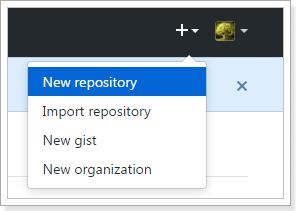
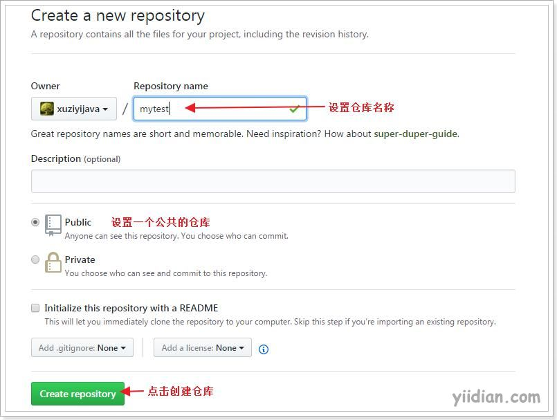
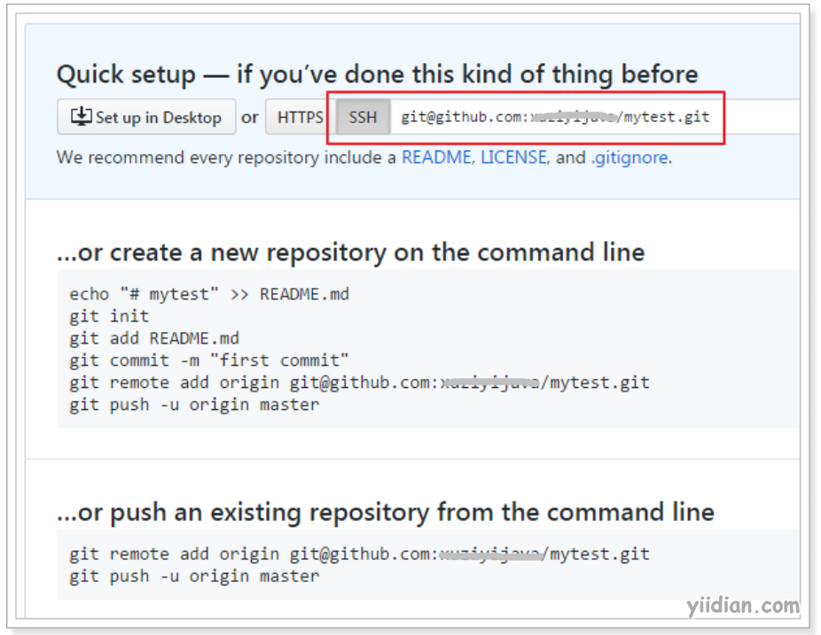

# 在github上创建仓库

现在我们已经在本地创建了一个Git仓库，又想让其他人来协作开发，此时就可以把本地仓库同步到远程仓库，同时还增加了本地仓库的一个备份。
常用的远程仓库github：https://github.com/

接下来我们演示如何将本地代码同步到github。

## **1 在github上创建仓库**

首先你得在github上创建一个账号，然后在github上创建一个仓库：

点击“create repository”按钮仓库就创建成功了。

Github支持两种同步方式“`https`”和“`ssh`”。如果使用https很简单基本不需要配置就可以使用，但是每次提交代码和下载代码时都需要输入用户名和密码。而且如果是公司配置的私有git服务器一般不提供https方式访问，所以我们`着重使用“ssh”方式`。