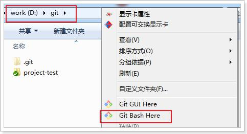

# ssh方式同步代码

## **1 什么是ssh?**

SSH是英文Secure Shell的简写形式。通过使用SSH，你可以把所有传输的数据进行加密，这样"中间人"这种攻击方式就不可能实现了，而且也能够防止DNS欺骗和IP欺骗。

使用SSH，还有一个额外的好处就是传输的数据是经过压缩的，所以可以加快传输的速度。SSH有很多功能，它既可以代替Telnet，又可以为FTP、Pop、甚至为PPP提供一个安全的"通道"。

如果一个用户从本地计算机，使用SSH协议登录另一台远程计算机，我们就可以认为，这种登录是安全的，即使被中途截获，密码也不会泄露。

最早的时候，互联网通信都是明文通信，一旦被截获，内容就暴露无疑。1995年，芬兰学者Tatu Ylonen设计了SSH协议，将登录信息全部加密，成为互联网安全的一个基本解决方案，迅速在全世界获得推广，目前已经成为Linux系统的标准配置。

## **2 生成ssh密钥**

在windows下我们可以使用 Git Bash.exe来生成密钥，可以通过开始菜单或者右键菜单打开Git Bash


git bash 执行命令,生命公钥和私钥
命令:

```bash
ssh-keygen -t rsa
```


执行命令完成后,在window本地用户.ssh目录C:\Users\用户名\.ssh下面生成如下名称的公钥和私钥:


## **3 在github配置ssh密钥**

密钥生成后需要在github上配置密钥本地才可以顺利访问。


使用文本编辑器打开刚刚生成的公钥(id_rsa.pub)，在key部分将id_rsa.pub文件内容添加进去，然后点击“Add SSH key”按钮完成配置。

## **4 同步到远程仓库**

### **4.1 使用git bash**

在仓库所在的目录（D:\git）点击右键选择“Git Bash Here”，启动git bash程序。



然后在git bash中执行如下语句：

```bash
git remote add origin git@github.com:账户名/mytest.git
git push -u origin master
```


如果出现如下错误：


可以先执行如下命令，然后再执行上面的命令

```bash
$ git remote rm origin
```

正常的效果：

**4.2 使用TortoiseGit同步**

由于TortoiseGit使用的ssh工具是“PuTTY”git Bash使用的ssh工具是“openSSH”，如果想让TortoiseGit也使用刚才生成的密钥可以做如下配置：


URL：远程仓库的地址
推送URL：也是相同的
Putty密钥：选择刚才生成的密钥中的私钥

完成以上步骤后，在本地仓库的文件夹中单击右键，选择“Git同步”


