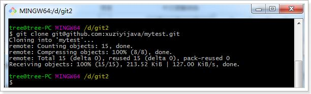
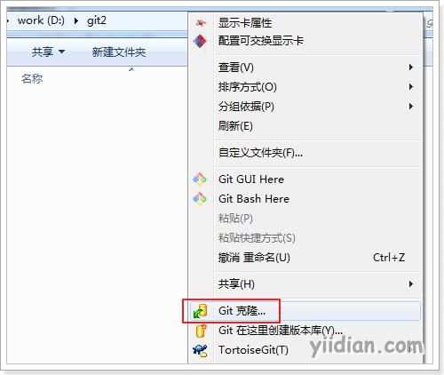
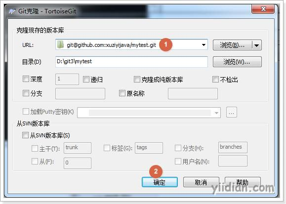
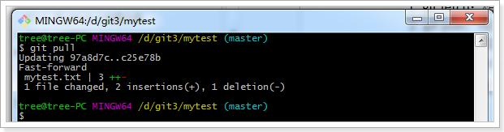
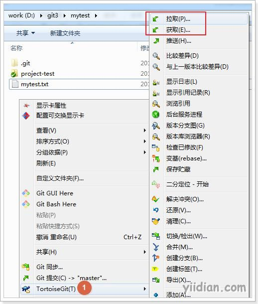

# 从远程仓库克隆代码

## **1 从远程仓库克隆**

克隆远程仓库也就是从远程把仓库复制一份到本地，克隆后会创建一个新的本地仓库。选择一个任意部署仓库的目录，然后克隆远程仓库。

### **1.1 使用git bash**

```bash
$ git clone git@github.com:账户名/mytest.git
```

### 

### **1.2 使用TortoiseGit**

在任意目录点击右键：





## **2 从远程仓库取代码**

Git中从远程的分支获取最新的版本到本地有这样2个命令：
1.`git fetch`：相当于是从远程获取最新版本到本地，不会自动merge（合并代码）
2.`git pull`：相当于是从远程获取最新版本并merge到本地
上述命令其实相当于git fetch 和 git merge



在实际使用中，git fetch更安全一些，因为在merge前，我们可以查看更新情况，然后再决定是否合并。

 

如果使用TortoiseGit的话可以从右键菜单中点击“拉取”（pull）或者“获取”（fetch）在实际使用中，git fetch更安全一些，因为在merge前，我们可以查看更新情况，然后再决定是否合并。

