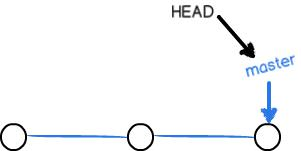

# TortoiseGit分支管理

## **1 Git分支的原理**

在我们每次的提交，Git都把它们串成一条时间线，这条时间线就是一个分支。截止到目前，只有一条时间线，在Git里，这个分支叫主分支，即master分支。HEAD指针严格来说不是指向提交，而是指向master，master才是指向提交的。

一开始的时候，master分支是一条线，Git用master指向最新的提交，再用HEAD指向master，就能确定当前分支，以及当前分支的提交点：

 

每次提交，master分支都会向前移动一步，这样，随着你不断提交，master分支的线也越来越长。

当我们创建新的分支，例如dev时，Git新建了一个指针叫dev，指向master相同的提交，再把HEAD指向dev，就表示当前分支在dev上：

Git创建一个分支很快，因为除了增加一个dev指针，改改HEAD的指向，工作区的文件都没有任何变化！

不过，从现在开始，对工作区的修改和提交就是针对dev分支了，比如新提交一次后，dev指针往前移动一步，而master指针不变：

假如我们在dev上的工作完成了，就可以把dev合并到master上。Git怎么合并呢？最简单的方法，就是直接把master指向dev的当前提交，就完成了合并：

所以Git合并分支也很快！就改改指针，工作区内容也不变！

合并完分支后，甚至可以删除dev分支。删除dev分支就是把dev指针给删掉，删掉后，我们就剩下了一条master分支：

## **2 使用TortoiseGit实现分支管理**

### **2.1 创建分支**

在本地仓库文件夹中点击右键，然后从菜单中选择“创建分支”：

如果想创建完毕后直接切换到新分支可以勾选“切换到新分支”选项或者从菜单中选择“切换/检出”来切换分支：

### **2.2 合并分支**

分支切换到dev后就可以对工作区的文件进行修改，然后提交到dev分支，原来的master分支不受影响。例如我们修改mytest.txt中的内容，然后提交到dev分支。

切换到master分支后还是原理的内容：

将dev分支合并到master分支，当前分支为master。从右键菜单中选择合并

再查看mytest.txt的内容就已经更新了：

