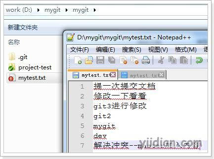
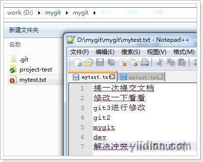
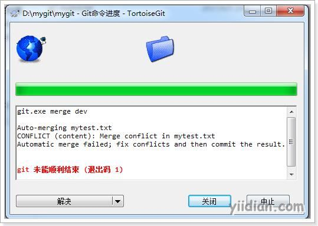
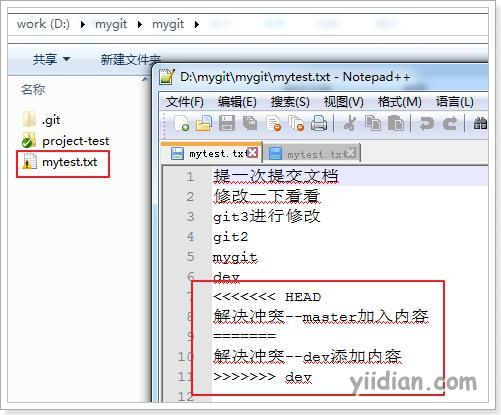
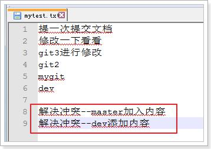
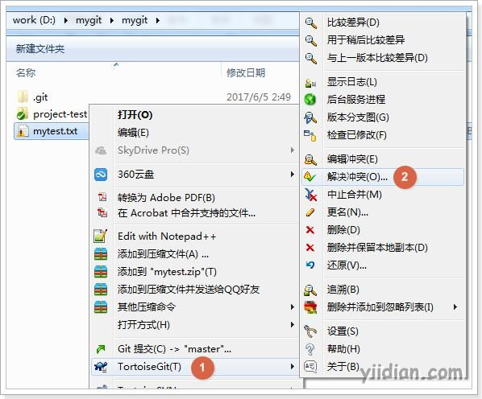
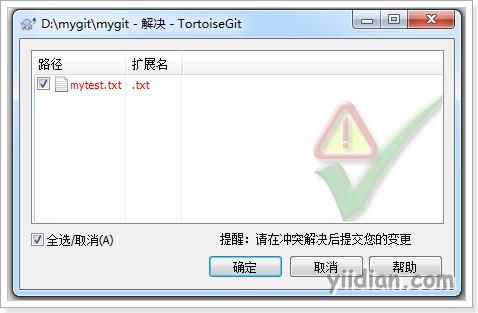
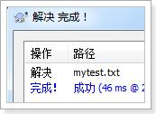

# TortoiseGit解决代码冲突

两个分支中编辑的内容都是相互独立互不干扰的，那么如果在两个分支中都对同一个文件进行编辑，然后再合并，就有可能会出现冲突。

## **1 模拟冲突产生**

例如在master分支中对mytest.txt进行编辑：

然后提交到版本库。

切换到dev分支，对mytest.txt进行编辑：

然后提交到版本库。

最后进行分支合并，例如将dev分支合并到master分支。需要先切换到master分支然后进行分支合并。

这时出现版本冲突。

## **2 解决代码冲突**

冲突需要手动解决，如下图解决完毕：

在冲突文件上单击右键选择“解决冲突”菜单项：

把冲突解决完毕的文件提交到版本库就可以了。