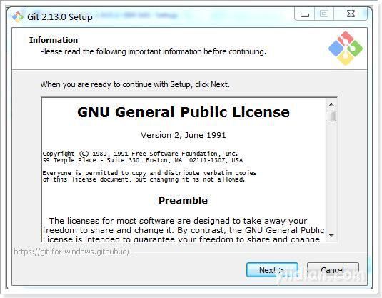

# Git的安装

最早Git是在Linux上开发的，很长一段时间内，Git也只能在Linux和Unix系统上跑。不过，慢慢地有人把它移植到了Windows上。现在，Git可以在Linux、Unix、Mac和Windows这几大平台上正常运行了。由于开发机大多数情况都是windows，所以本教程只讲解windows下的git的安装及使用。

## **1 Git软件下载**

下载地址：https://git-scm.com/download

根据不同的操作系统选择对应的安装包。

## **2 安装git for windows**

一路“Next”使用默认选项即可。

## **3 安装TortoiseGit**

一路“Next”使用默认选项即可。
默认选项下会启动配置画面：

由于目前只有英文语言包，默认即可继续下一步。
配置git.exe，在4.2.1中已经安装过git-for-windows了所以在此找到git.exe所在的目录。

配置开发者姓名及邮箱，每次提交代码时都会把此信息包含到提交的信息中。

使用默认配置，点击“完成”按钮完成配置。

完整完毕后在系统右键菜单中会出现git的菜单项。

## **4 安装中文语言包**

安装中文语言包并不是必选项。可以根据个人情况来选择安装。

直接“下一步”完整完毕。

鼠标右键选择Settings

语言包安装完毕后可以在TortoiseGit的设置中调整语言。

