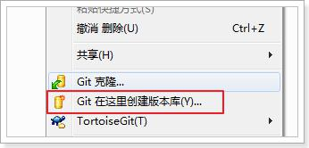

# 创建版本库

什么是版本库呢？版本库又名仓库，英文名repository，你可以简单理解成一个目录，这个目录里面的所有文件都可以被Git管理起来，每个文件的修改、删除，Git都能跟踪，以便任何时刻都可以追踪历史，或者在将来某个时刻可以“还原”。由于git是分布式版本管理工具，所以git在不需要联网的情况下也具有完整的版本管理能力。


创建一个版本库非常简单，可以使用`git bash`也可以使用`TortoiseGit`。首先，选择一个合适的地方，创建一个空目录（D:\git）。

## **1 使用GitBash创建仓库**

在当前目录中点击右键中选择Git Bash来启动。


创建仓库执行命令：

```bash
$ git init
```


## **2 使用TortoiseGit创建仓库**

使用TortoiseGit时只需要在目录中点击右键菜单选择“在这里创建版本库”




版本库创建成功，会在此目录下创建一个.git的隐藏目录，如下所示：


**版本库目录：**“.git”目录就是版本库，将来文件都需要保存到版本库中。
**工作目录：**包含“.git”目录的目录，也就是.git目录的上一级目录就是工作目录。只有工作目录中的文件才能保存到版本库中。