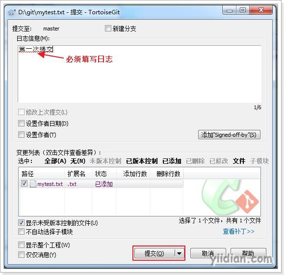

# 添加文件

## **1 添加文件**

在D:\git目录下创建一个mytest.txt文件

文本文件变为带“+”号的图标：

## **2 提交文件**

在mytest.txt上再次点击右键选择“提交”，此时将文件保存至版本库中。

## **3 工作区和暂存区的区别**

Git和其他版本控制系统如SVN的一个不同之处就是有暂存区的概念。

**什么是工作区（Working Directory）？**

工作区就是你在电脑里能看到的目录，比如我的git文件夹就是一个工作区。
其实git目录是工作区，在这个目录中的“.git”隐藏文件夹才是版本库。

Git的版本库里存了很多东西，其中最重要的就是称为stage（或者叫index）的暂存区，还有Git为我们自动创建的第一个分支master，以及指向master的一个指针叫HEAD。
如下图所示：

分支和HEAD的概念我们后面文章再讲。前面讲了我们把文件往Git版本库里添加的时候，是分两步执行的：

第一步是用git add把文件添加进去，实际上就是把文件修改添加到暂存区；
第二步是用git commit提交更改，实际上就是把暂存区的所有内容提交到当前分支。

因为我们创建Git版本库时，Git自动为我们创建了唯一一个master分支，所以，现在，git commit就是往master分支上提交更改。可以简单理解为，需要提交的文件修改通通放到暂存区，然后，一次性提交暂存区的所有修改。