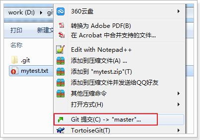
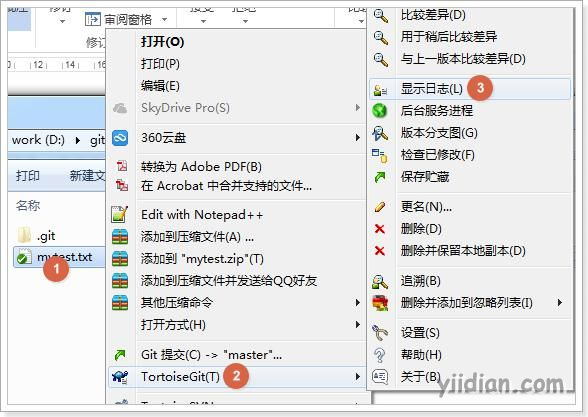
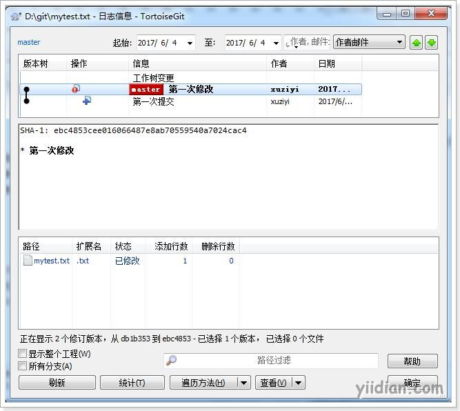
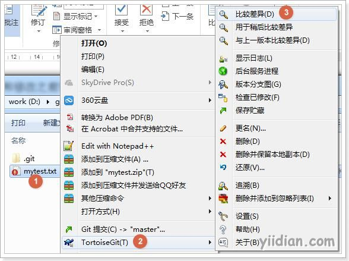
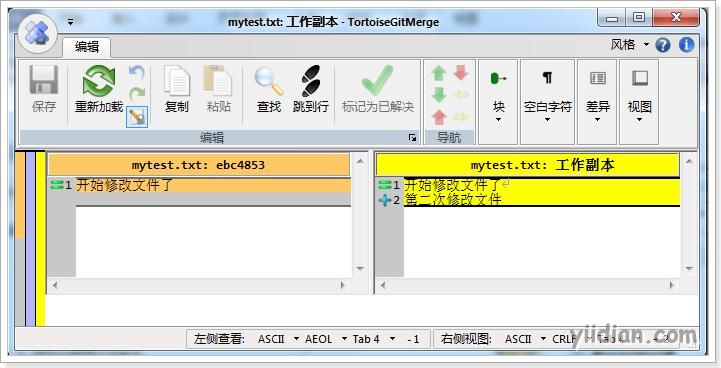
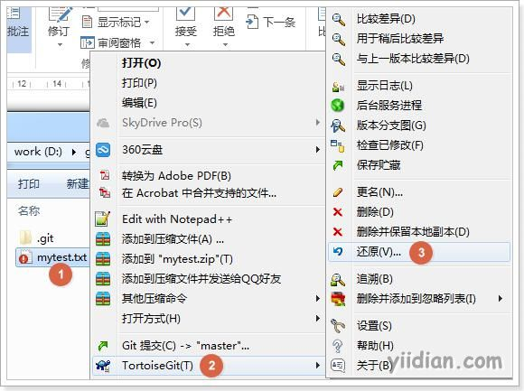
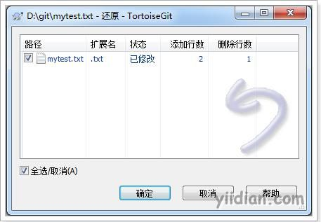
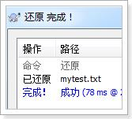

# 修改文件

## **1 文件提交修改**

被版本库管理的文件不可避免的要发生修改，此时只需要直接对文件修改即可。修改完毕后需要将文件的修改提交到版本库。

在修改后的mytest.txt(修改后图标变成红色感叹号)文件上点击右键，然后选择“提交”，和之前的提交方式一样。



## **2 查看文件修改历史**

在开发过程中可能会经常查看代码的修改历史，或者叫做查看代码的修改日志。用来查看某个版本是谁修改的，什么时间修改的，修改了哪些内容。


可以在文件上点击右键选择“显示日志”来查看文件的修改历史。



## **3 差异比较**

当文件内容修改后，需要和修改之前对比一下修改了哪些内容此时可以使用“比较差异功能”。





## **4 还原修改**

当文件修改后不想把修改的内容提交，还想还原到未修改之前的状态。此时可以使用“还原”功能。







```
注意：此操作会撤销所有未提交的修改，所以当做还原操作是需要非常慎重！！！
```