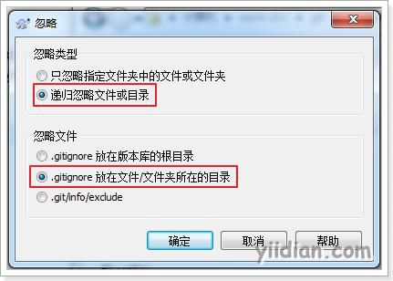
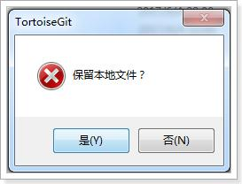
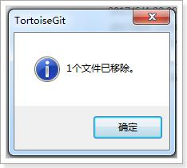
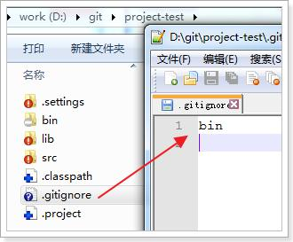

# .gitignore忽略文件

## **1 利用.gitignore忽略文件**

在某些项目中，并不是所有文件都需要保存到版本库中的例如一个Java项目的“bin”目录及目录下的文件就可以忽略。好在Git考虑到了大家的感受，这个问题解决起来也很简单，我们在Git工作区的根目录下创建一个特殊的`.gitignore`文件，然后把要忽略的文件名填进去，Git就会自动忽略这些文件。


如果使用`TortoiseGit`的话可以使用菜单项直接进行忽略。





选择保留本地文件。完成后在此文件夹内会多出一个`.gitignore`文件，这个文件就是文件忽略文件，当然也可以手工编辑。其中的内容就是把bin目录忽略掉。



## **2 附录：忽略文件语法规范**

空行或是以 # 开头的行即注释行将被忽略。
可以在前面添加正斜杠 / 忽略当前路径文件，但不包括子目录的同名文件。
可以在后面添加正斜杠 / 来忽略文件夹。
可以使用 ! 来否定忽略，即比如在前面用了 *.apk ，然后使用 !a.apk ，则这个a.apk不会被忽略。
\* 用来匹配零个或多个字符，如 *.[oa] 忽略所有以".o"或".a"结尾， *~ 忽略所有以 ~ 结尾的文件（这种文件通常被许多编辑器标记为临时文件）； [] 用来匹配括号内的任一字符，如 [abc] ，也可以在括号内加连接符，如 [0-9] 匹配0至9的数； ? 用来匹配单个字符。 

看了这么多，还是应该来个栗子：

```ini
# 忽略 .a 文件
*.a
# 但否定忽略 lib.a, 尽管已经在前面忽略了 .a 文件
!lib.a
# 仅在当前目录下忽略 TODO 文件， 但不包括子目录下的 subdir/TODO
/TODO
# 忽略 build/ 文件夹下的所有文件
build/
# 忽略 doc/notes.txt, 不包括 doc/server/arch.txt
doc/*.txt
# 忽略所有的 .pdf 文件 在 doc/ directory 下的
doc/**/*.pdf
```

 